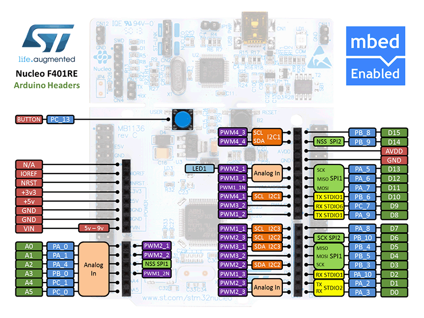

# Internet of Things - Groupe firmware
Dans le cadre du cours IOT à la HEIG-VD, Suisse.

## Introduction
[Introduction à ce repository]
Par exemple: Ce repository est consacré à la partie...

## Technologies utilisées
[Technologies utilisées]

Capteur :

https://www.espruino.com/BME680

La BME680 est un capteur d'environnement fabriqué par Bosch. Elle permet de mesurer la température, la pression, l'humidté et la résistance au gaz. Elle s'exécute à partir d'une tension de 3.3V et communique avec la sortie du microcontrolleur via les bus SPI ou I2C.

LoRa :

https://www.espruino.com/RN2483
http://ww1.microchip.com/downloads/en/DeviceDoc/40001784B.pdf

Connectique :

https://www.mikroe.com/arduino-uno-click-shield

Arduino Uno est une extension pour Arduino Uno. Il contient deux micro bus permettant de connecter à arduino plus de 75 click board différentes. Il permet d'ajouter des fonctionnalités comme GSM, Wifi, Zigbee, Bluethooth...

Carte :

http://www.st.com/en/evaluation-tools/nucleo-f401re.html

La carte STM32 est une carte développée par Nucleo STMicroelectronics. Cette carte dispose

- de deux type de ressources d'extension :
  -  une connectivité Arduino Uno révision 3
  - un
- Alimentation électrique de carte flexible
- Trois LED                 
- Deux boutons-poussoirs : UTILISATEUR et REMISE À ZÉRO
- Capacité de ré-énumération USB : trois différentes interfaces prises en charge sur USB     
  - Port Com virtuel
  - Stockage de masse
  - Port de débogage            
- Et toute une série de périphériques et de composants.

Le but est de connecter le module Lora(LoRa click) et le capteur BME680(Environment click) via la connectivitée Arduino Uno (Arduino Uno click SHIELD)  pour transférer les données du capteur vers l'application web.

## Spécificités
[Spécificités à savoir pour la partie du projet]
### Envoie des données

#### Header
| 15          | 14       | 13       | 12             | 11-2     | 1               | 0               |
|-------------|----------|----------|----------------|----------|-----------------|-----------------|
| temperature | pressure | humidity | gas resistance | not used | die temperature | battery voltage |

16 bits pour indiquer ou non la présence de la donnée.
#### Données

| Taille  | Donnée          | Conversion |
|---------|-----------------|------------|
| 16 bits | temperature     | °C * 10    |
| 16 bits | pressure        | hPa * 10   |
| 16 bits | humidity        | % * 100    |
| 16 bits | gas resistance  | Ohms / 10  |
| 16 bits | die temperature | °C * 10    |
| 16 bits | battery voltage | V * 10     |

Le tout est converti en une string d'hexadécimal.
(David viens m'aider stp c'est toi qui a fait)

### Comunication du changement de fréquence d'échantillonnage
Pour changer la fréquences d'échantillonnage d'un noeuds, il faut lui envoyer un payload en JSON, converti en Hexadécimal.

Le JSON se présente sous le format suivant : `{"newInterval": value}`

La `value` est en millisecondes.

La fréquence d'échantillonnage de base reste à définir.

## Déploiement
[Instruction de déploiement/utilisation]

## Conclusion
[Points à améliorer, points en suspens, améliorations futures, ...]

## Note dev

Payload:
https://docs.google.com/spreadsheets/d/1PmNmLVsm3uHxBaLA38uTDL-t3WrtRHb4Pu9JmiWj3Kg/edit?usp=sharing

Datasheet:

