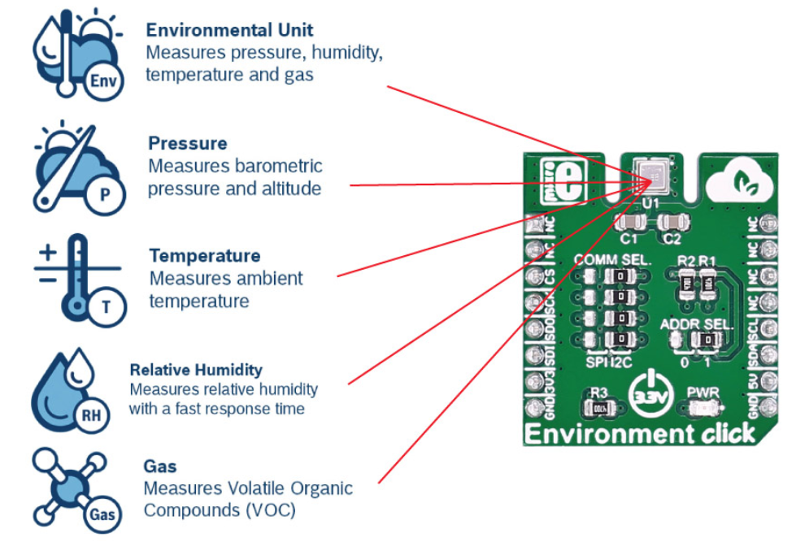
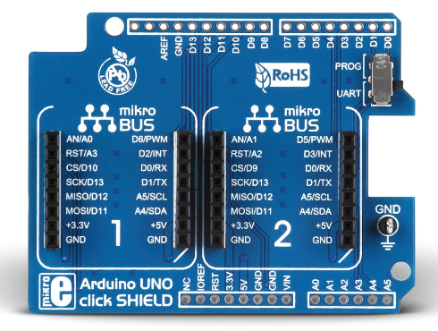
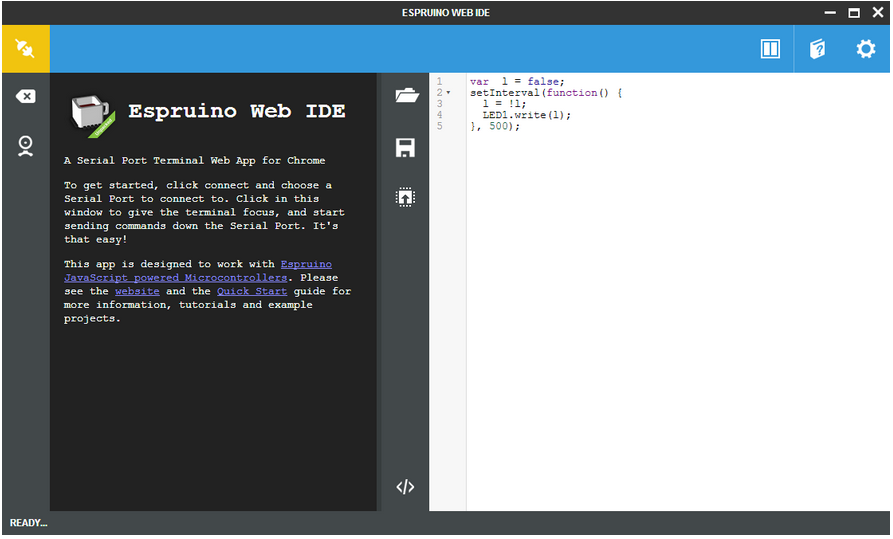
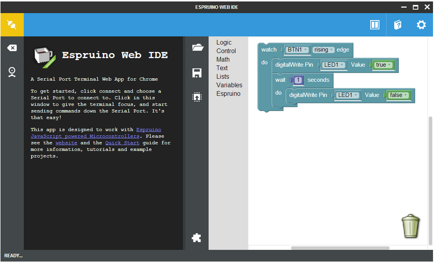

# Internet of Things - Groupe firmware
Dans le cadre du cours IOT à la HEIG-VD, Suisse.

## Introduction
[Introduction à ce repository]

 Ce repository ce veut être un rapport descriptif de la partie firmware du projet de semestre réalisé dans le cadre du cours du cours IOT(Internet des Objets) 2018.

## Technologies utilisées
[Technologies utilisées]

Capteur :

https://www.espruino.com/BME680

La BME680 est un capteur d'environnement fabriqué par Bosch. Elle permet de mesurer la température, la pression, l'humidté et la résistance au gaz. Elle s'exécute à partir d'une tension de 3.3V et communique avec la sortie du microcontrolleur via les bus SPI ou I2C. Dans le cadre de ce projet, nous utilisons le protocole I2C.

LoRa :

https://www.espruino.com/RN2483
http://ww1.microchip.com/downloads/en/DeviceDoc/40001784B.pdf

Connectique :

https://www.mikroe.com/arduino-uno-click-shield

Arduino Uno est une extension pour Arduino Uno. Il contient deux micro bus permettant de connecter à arduino plus de 75 click board différentes. Il permet d'ajouter des fonctionnalités comme GSM, Wifi, Zigbee, Bluethooth...

Carte :

http://www.st.com/en/evaluation-tools/nucleo-f401re.html

La carte STM32 est une carte développée par Nucleo STMicroelectronics. Cette carte dispose

- de deux types de ressources d'extension :
  -  une connectivité Arduino Uno révision 3
  -  un ST morpho pour les pins d'entête permettant un access à toutes les I/O de la STM32.
- Alimentation électrique de carte flexible
- Trois LED
- Deux boutons-poussoirs : UTILISATEUR et REMISE À ZÉRO
- Capacité de ré-énumération USB : trois différentes interfaces prises en charge sur USB
  - Port Com virtuel
  - Stockage de masse
  - Port de débogage
- Et toute une série de périphériques et de composants.

Le but est de connecter le module Lora(LoRa click) et le capteur BME680(Environment click) via la connectivitée Arduino Uno (Arduino Uno click SHIELD)  pour transférer les données du capteur vers l'application web.Pour ce faire, nous avons utilisé l'IDE Espruino  et le langage javaScript pour la configuration de la partie UART et la partie I2C(cf sources).

ide:

http://www.espruino.com/

L'IDE web Espruino est un éditeur graphique open source conçu pour écrire et débugger du code sur des microcontrôleurs utilisant l'interpréteur JavaScript Espruino. Il peut également fonctionner en natif via Node.js et Electron, ou une version avec E / S limitée peut être utilisée comme site web.

 

| Version                                             | Communications                                               | Benefits                                                     |
| --------------------------------------------------- | ------------------------------------------------------------ | ------------------------------------------------------------ |
| [Chrome Web App](#installing-from-chrome-web-store) | USB, Serial, [Audio](http://www.espruino.com/Headphone), TCP/IP | Easy to install from [Chrome Web Store](https://chrome.google.com/webstore/detail/espruino-serial-terminal/bleoifhkdalbjfbobjackfdifdneehpo) |
| [Node.js App](#installing-from-npm) / NW.js app     | USB, Serial, Bluetooth Low Energy                            | Can be run of systems without Chrome web browser             |
| [Web Version](#full-web-version)                    | [Audio](http://www.espruino.com/Headphone), Bluetooth Low Energy (via [Web Bluetooth](https://webbluetoothcg.github.io/web-bluetooth/)) | Just go to [a URL](https://espruino.github.io/EspruinoWebIDE/) |

## Spécificités

[Spécificités à savoir pour la partie du projet]

### Noeuds
| Device N° | EUI              | Click Type  |
|-----------|------------------|-------------|
| 1         | 0004A30B001ADE26 | Environment |
| 2         | 0004A30B001A798B | Environment |
| 3         | 0004A30B001AD01A | Environment |
| 4         | 0004A30B001A602D | Environment |
| 5         | 0004A30B001A1E25 | Ambiant     |
| 6         | 0004A30B001A5BE8 | Ambiant     |

### Envoie des données

#### Header
| 15          | 14       | 13       | 12             | 11         |10-2     | 1               | 0               |
|-------------|----------|----------|----------------|------------|----------|-----------------|-----------------|
| temperature | pressure | humidity | gas resistance | Light            | not used | die temperature | battery voltage |

16 bits pour indiquer ou non la présence de la donnée.
Pour les capteurs actuels, les headers sont les suivants:
* Environment (BME680): `F003` (temperature, pression, humidité, gas res., temperature carte, batterie)
* Ambient (OPT3001):    `0803` (lumière, temperature carte, batterie)
#### Données

| Taille  | Donnée          | Conversion |
|---------|-----------------|------------|
| 16 bits | temperature     | °C * 10    |
| 16 bits | pressure        | hPa * 10   |
| 16 bits | humidity        | % * 100    |
| 16 bits | gas resistance  | Ohms / 10  |
| 16 bits | Light           | Lux        |
| 16 bits | die temperature | °C * 10    |
| 16 bits | battery voltage | V * 10     |

Le module LoRa demande d'envoyer une chaîne de caractères hexadecimale. Les valeurs doivent donc être convertie en temps que tel. Pour faciliter la lecture, chaque valeur est envoyée sur 4 digits (16bits => 4 digits hex).  
Exemple de payload envoyé:
* `F003003004500000001000240021`

On y voit le header `F003` (qui signifie que toute les valeurs sauf la lumière sont dans le payload, comme pour le capteur *BME*), suivit des champs qui y sont indiqués dans l'ordre (les valeurs ici sont non representatives des valeurs réelles).

#### Remarques
Le niveau de batterie est, pour l'instant une valeur factice car la carte *Nucleo* ne permet pas de la récupérer.

### Communication du changement de fréquence d'échantillonnage
Pour changer la fréquences d'échantillonnage d'un noeuds, il faut lui envoyer un payload en JSON, converti en Hexadécimal.

Le JSON se présente sous le format suivant : `{"newInterval": value}`

La `value` est en millisecondes.

La fréquence d'échantillonnage de base reste à définir.

## Déploiement
Le déploiement des capteurs se fait de manière simple:
* Changer la position du jumper central droite (pins gauches connectées) pour router l'alimentation sur les batterie et non plus sur USB.
* Insérer les piles.
* Load le programme de façon classique grâce à l'IDE.
* Débranché le cable USB.

### Remarques
Le fait de lancer le FW à l'allumage ne fonctionne pas. Une erreur invalid_param est reçue lors de l'envoi de l'appkey. Nous pensions que c'était du à un problème de capacités mal chargées donc nous avons mis un timeout de 2s avant de lancer l'initialisation des modules et des bus.  
Malheureusement, cela n'a pas suffi. Pour palier à ce problème, la marche à suivre en ci-dessus propose d'insérer les piles avant de load le FW. Cela fonctionne.

## Tests effectués
Nous avons tester la connexion au LoRa server avec la gateway TTN. Cela fonctionne sans aucun problème et les données transitent des deux sens.  
Avec la gateway Raspberry PI, nous rencontrons des problèmes liés à un timeout lors de l'attente de la réponse du join (denied reçu). Nous pensons que cela vient de la gateway qui doit mal gérer la requête.  

## Conclusion
Dans l'ensemble, les points qui ont été demandés au groupe FW ont été atteint. Comme dit précédemment, des soucis surviennent lorsque le FW est loader depuis la mémoire directement après allumage et la communication avec la gateway bloque au join. Pour le premier problème, nous avons tenter de le résoudre mais cela n'a pas fonctionné et nous ne comprenons vraiment pas pourquoi.  
Pour le 2ème, des problèmes du côté de la gateway en sont probablement la cause, vu qu'en utilisant celle de TTN, nous ne rencontrons aucun problème.  

En conclusion, ce projet était une bonne approche à l'IoT et nous sommes heureux d'avoir pu travailler sur le FW particulièrement. Le fait d'avoir utilisé le Framework Espruino était une bonne découverte au vu de sa simplicité (debug et API offerte).

## Note dev

Payload:
https://docs.google.com/spreadsheets/d/1PmNmLVsm3uHxBaLA38uTDL-t3WrtRHb4Pu9JmiWj3Kg/edit?usp=sharing

Datasheet:

